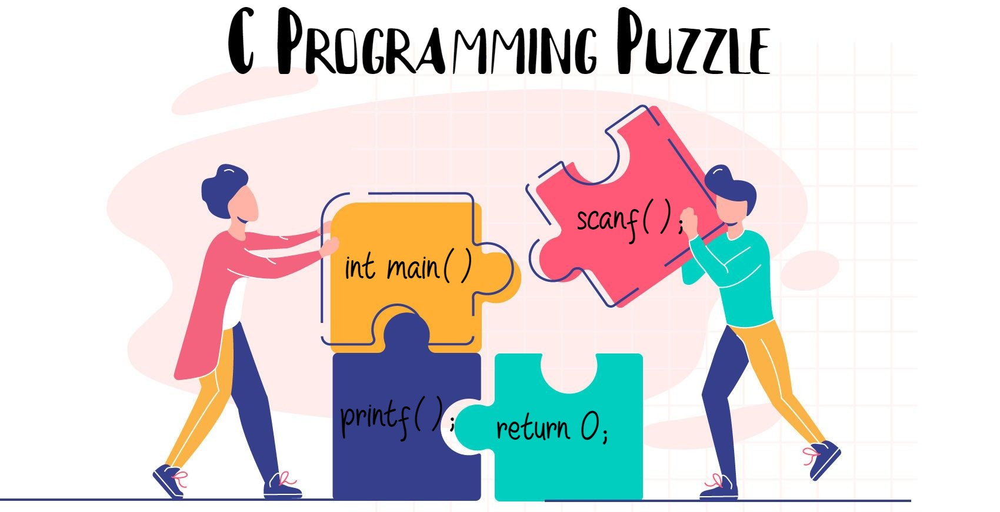

 
<b>`Code Puzzle` [`Click Here`](https://www.codepuzzle.io/){:target="_blank"}</b>

### Solve the Puzzles

1. <b>`Solve the puzzle to print "Hello World!"` [`Click Here`](./puzzles/1.html){:target="_blank"} </b>
   
2. <b>`Solve the puzzle to ...............` [`Click Here`](){:target="_blank"}</b>
   
3. <b>`Solve the puzzle to ...............` [`Click Here`](){:target="_blank"}</b>
   
4. <b>`Solve the puzzle to ...............` [`Click Here`](){:target="_blank"}</b>

5. <b>`Solve the puzzle to ...............` [`Click Here`](){:target="_blank"}</b>
   
6. <b>`Solve the puzzle to ...............` [`Click Here`](){:target="_blank"}</b>

7. <b>`Solve the puzzle to ...............` [`Click Here`](){:target="_blank"}</b>

8. <b>`Solve the puzzle to ...............` [`Click Here`](){:target="_blank"}</b>

9. <b>`Solve the puzzle to ...............` [`Click Here`](){:target="_blank"}</b>

10. <b>`Solve the puzzle to ...............` [`Click Here`](){:target="_blank"}</b>
